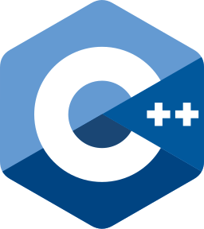
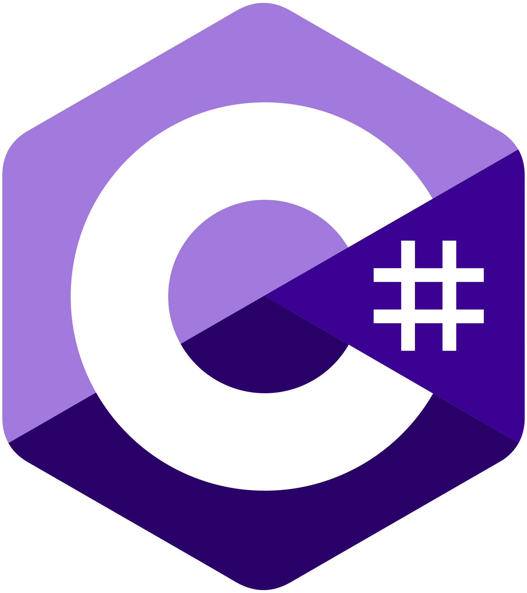
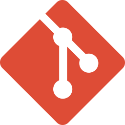

## Hola, soy José Zenteno 👋

Soy estudiante de la **Tecnicatura Universitaria en Programación en la UTN General Pacheco**, enfocado en el desarrollo **Backend** y en búsqueda de mi primera oportunidad profesional en el sector IT.

Cuento con formación previa como Técnico Electromecánico, lo que consolidó mi forma de trabajar: ante un problema complejo suelo investigar, dividirlo en partes y analizar cada componente de manera ordenada antes de implementar la solución. Utilizo la inteligencia artificial como un asistente de aprendizaje y productividad para comprender a fondo conceptos técnicos y optimizar mi flujo de trabajo.

## 💻 Stack Tecnológico

                 

*   **Arquitectura y Backend:** ASP.NET Core Web API, diseño de APIs REST (Controllers, DTOs, endpoints, JSON).
*   **Bases de Datos:** Consultas avanzadas en SQL, JOINs, agregaciones, subconsultas y acceso a datos mediante ADO.NET.

## 📚 Actualmente incorporando

  

## 🌐 Contacto y Enlaces

