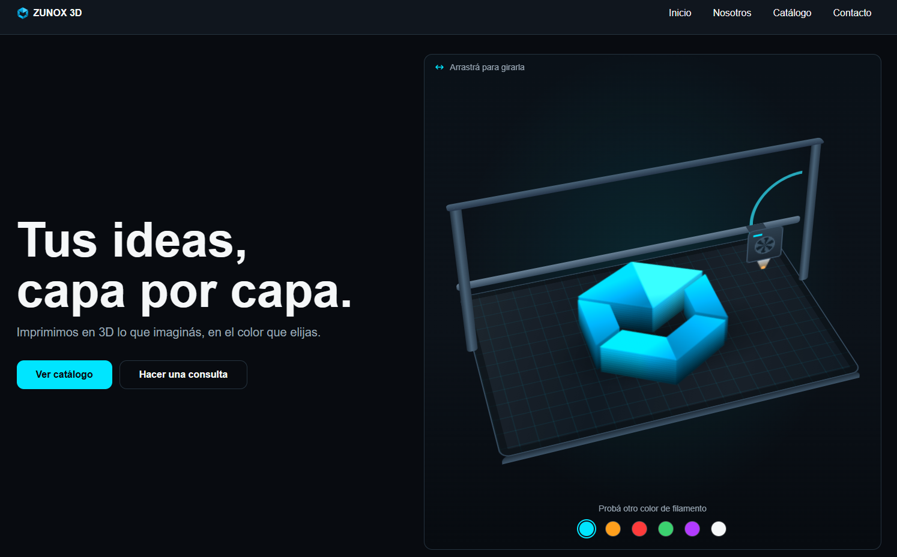
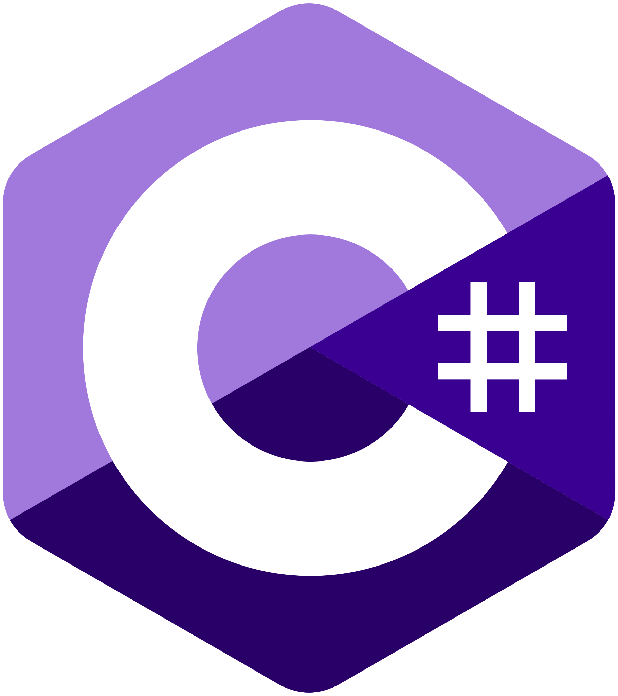
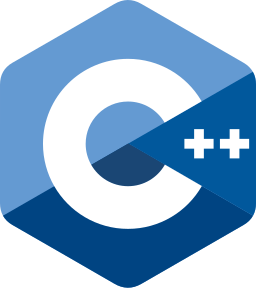
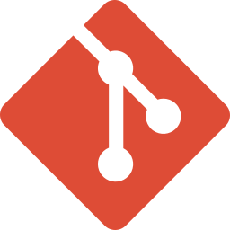
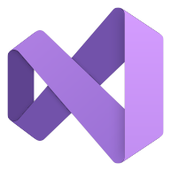

  

## Hola, soy José Zenteno 👋

Estudiante de la **Tecnicatura Universitaria en Programación (UTN FRGP)**, enfocado en **Backend** y buscando mi primera experiencia en IT.

Vengo de ser **Técnico Electromecánico**, y eso me dejó una forma de trabajar: ante un problema, lo divido en partes, entiendo cada una y recién después escribo código.

---

## 🚀 Proyectos destacados

<table>
  <tr>
    <td colspan="2" valign="top">
      
      <h3>🖨️ ZUNOX 3D · Gestión de pedidos de impresión 3D</h3>
      

        
        
      

      
Sitio y sistema interno de un emprendimiento real de impresión 3D: catálogo público, panel de administración de clientes y pedidos, link de seguimiento para cada cliente y avisos automáticos por mail. Está online y en uso.

      

        
        
        
        
        
      

      <a href="https://zunox3d.com.ar"><b>🌐 Ver sitio en vivo →</b></a>&emsp;
      <a href="https://github.com/TechIntoBios/Gestion-3D"><b>Ver repositorio →</b></a>
    </td>
  </tr>
  <tr>
    <td width="50%" valign="top">
      
      <h3>🚌 Sistema de Gestión de Transporte</h3>
      
Gestión completa de una empresa de micros: unidades, choferes, viajes, venta de pasajes con selección de butacas y reportes de recaudación.

      

        
        
        
      

      <a href="https://github.com/JoseZenteno269/SISTEMA-DE-GESTION-TRASNPORTE"><b>Ver repositorio →</b></a>
    </td>
    <td width="50%" valign="top">
      
      <h3>🏥 Sistema de Gestión Clínica</h3>
      
Sistema web para turnos, agendas médicas y pacientes, con roles Administrador / Médico y arquitectura en capas.

      

        
        
        
        
      

      <a href="https://github.com/JoseZenteno269/PROYECTO-CLINICA"><b>Ver repositorio →</b></a>
    </td>
  </tr>
  <tr>
    <td width="50%" valign="top">
      
      <h3>🛒 Tienda Tecnológica</h3>
      
E-commerce con API REST propia: catálogo con filtros, carrito con validación de stock e historial de compras.

      

        
        
        
        
      

      <a href="https://github.com/JoseZenteno269/Tienda_Tecnologica"><b>Ver repositorio →</b></a>
    </td>
    <td width="50%" valign="top">
      
      <h3>☕ Tienda Tecnológica 2.0</h3>
      
La misma tienda, rehecha en Java: API REST con Spring Boot, JDBC con procedimientos almacenados, triggers que ajustan el stock y API documentada con Swagger.

      

        
        
        
        
        
      

      <a href="https://github.com/JoseZenteno269/Tienda_Tecnologica_2.0"><b>Ver repositorio →</b></a>
    </td>
  </tr>
</table>

---

## 💻 Lenguajes

  &emsp;
  &emsp;
  &emsp;
  &emsp;
  &emsp;
  

## ⚙️ Backend y APIs

  &emsp;
  &emsp;
  &emsp;
  

* **APIs REST:** ASP.NET Core Web API y Spring Boot (controllers, DTOs, endpoints, JSON), documentadas con Swagger y probadas con Postman.
* **Arquitectura:** separación en capas (Controllers → Negocio → Datos), DTOs y entidades.

## 🗄️ Bases de datos

  &emsp;
  &emsp;
  &emsp;
  <!-- <picture>
    <source media="(prefers-color-scheme: dark)" srcset="./Iconos/mongodb-icon-dark.svg" />
    
  </picture> -->

* **SQL:** JOINs, agregaciones, subconsultas, procedimientos almacenados y triggers.
* **Acceso a datos:** ADO.NET en .NET y JDBC en Java.

## 🛠️ Herramientas e IDEs

  &emsp;
  <picture>
    <source media="(prefers-color-scheme: dark)" srcset="./Iconos/github_dark.svg" />
    
  </picture>&emsp;
  &emsp;
  &emsp;
  &emsp;
  &emsp;
  &emsp;
  &emsp;
  <picture>
    <source media="(prefers-color-scheme: dark)" srcset="./Iconos/opencode.svg" />
    
  </picture>

## 📚 Actualmente incorporando

  &emsp;
  

* **Android con Java** (no Kotlin), consumiendo APIs y con persistencia local en **SQLite**.

---

## 🌐 Contacto

  &emsp;&emsp;
  &emsp;&emsp;
  
  &emsp;&emsp;
  
 

